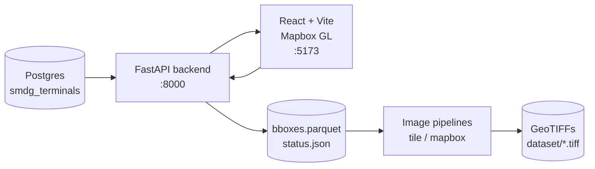

## Architecture

# Math Rendering Test
  ## Inline math                                     
  Einstein's mass-energy equivalence: $E = mc^2$. 
  The quadratic formula is 
  $x = \frac{-b \pm \sqrt{b^2 - 4ac}}{2a}$, 
  and Euler's identity 
  $e^{i\pi} + 1 =   0$ 
    is famously elegant.                            
                                                     
  ## Display math (block)                            
$$\int_{-\infty}^{\infty} e^{-x^2} \, dx = \sqrt{\pi}$$                                                 
                                                     
  ## Fractions, sums, products                       
$$\sum_{n=1}^{\infty} \frac{1}{n^2} = \frac{\pi^2}{6}\qquadprod_{k=1}^{n} k = n!$$

