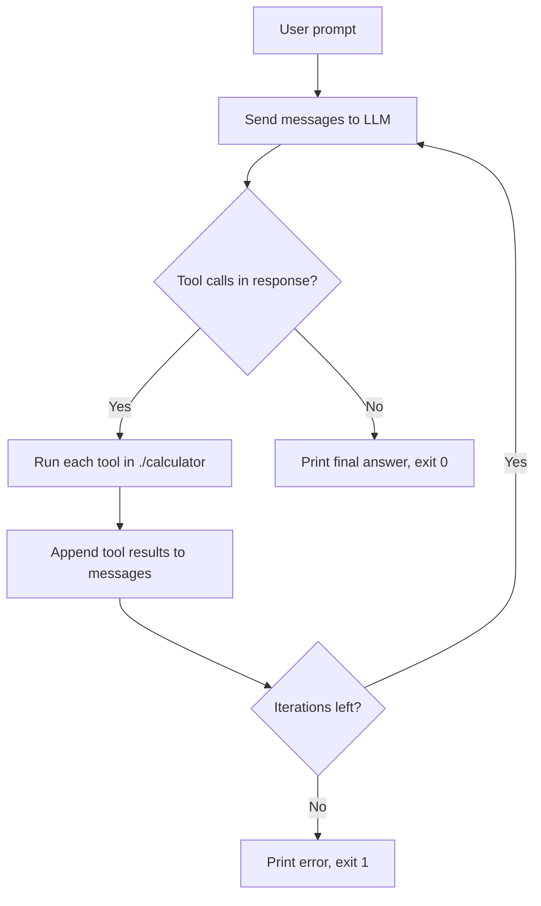

# OpenRouter AI Agent

A small command-line AI coding agent built in Python, following the [boot.dev](https://www.boot.dev) AI Agent course. It sends your prompt to an LLM through [OpenRouter](https://openrouter.ai), lets the model call a set of file-system tools, and loops until the model produces a final answer.

The agent is sandboxed to the `calculator/` directory, a small example project it can inspect, run, and modify.

## How it works



1. The system prompt and your prompt form the initial conversation.
2. Each iteration, the model either calls one or more tools or replies with plain text.
3. Every assistant message and tool result is appended to the conversation, so the model keeps full context.
4. The loop ends with exit code `0` when the model responds without tool calls, or exit code `1` after 20 iterations without a final answer.

## Available tools

| Tool | What it does |
| --- | --- |
| `get_files_info` | List files in a directory with their size and whether they are directories |
| `get_file_content` | Read a file (truncated at 10,000 characters) |
| `run_python_file` | Run a Python file with optional arguments (30 second timeout) |
| `write_file` | Create or overwrite a file |

All paths are resolved relative to `./calculator`. Any path that escapes that directory is rejected.

## Setup

Requires Python 3.13+ and [uv](https://docs.astral.sh/uv/).

```bash
git clone https://github.com/Kaz4510/open_router-ai-agent.git
cd open_router-ai-agent
uv sync
```

Create a `.env` file in the project root with your OpenRouter API key:

```
OPENROUTER_API_KEY=your-key-here
```

`.env` is listed in `.gitignore`, so the key is never committed.

## Usage

```bash
uv run main.py "<your prompt>" [--verbose]
```

Examples:

```bash
uv run main.py "what files are in the root?"
uv run main.py "how does the calculator render results to the console?" --verbose
uv run main.py "run the calculator tests and summarize the results"
```

`--verbose` prints the user prompt, token usage per request, and the arguments of each function call.

## Project structure

```
.
├── main.py              # CLI entry point and agent loop
├── prompts.py           # System prompt
├── config.py            # Settings (e.g. MAX_CHARS)
├── functions/           # Tool implementations and their JSON schemas
│   ├── call_function.py # Dispatches tool calls from the model
│   ├── get_files_info.py
│   ├── get_file_content.py
│   ├── run_python_file.py
│   └── write_file.py
├── calculator/          # Sandboxed example project the agent works on
└── test_*.py            # Manual tests for each tool
```

## Safety note

This agent can write files and execute Python code. It is restricted to `./calculator`, but it is a learning project, not a hardened sandbox. Don't point it at directories containing anything you care about.
